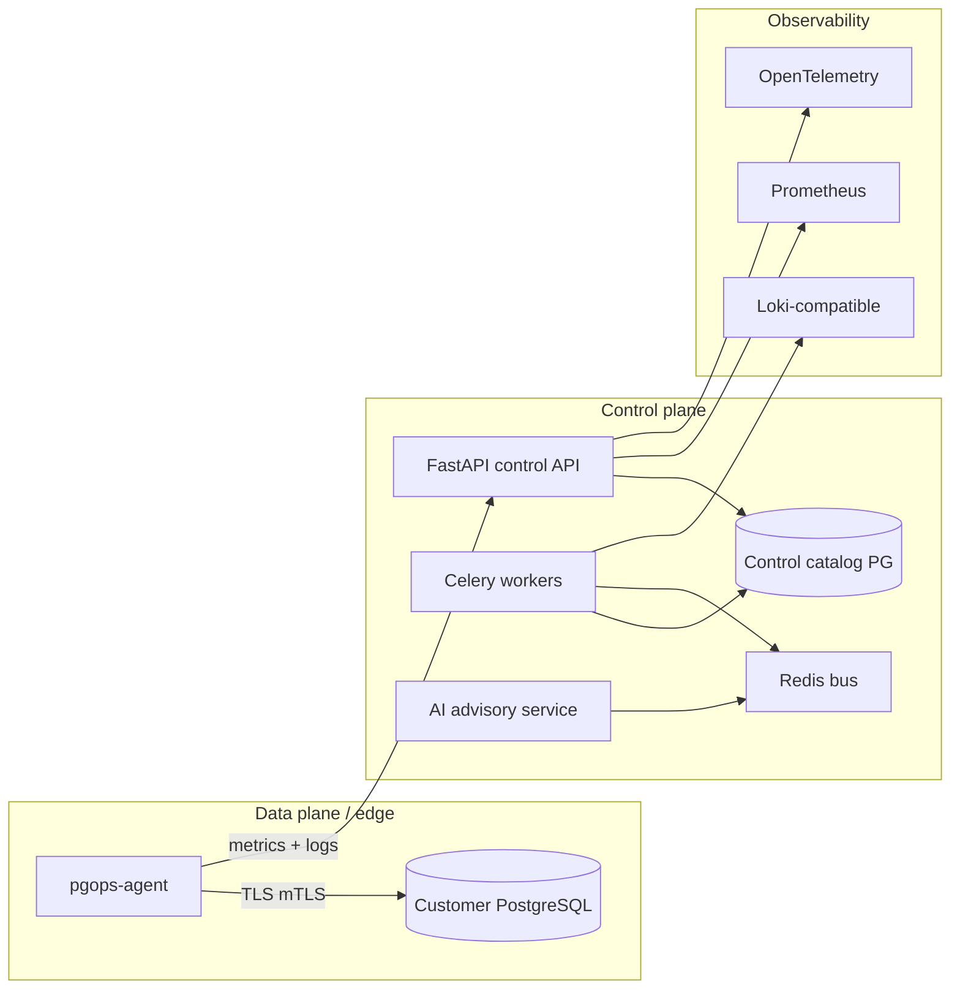

# Architecture — PostgresOps Enterprise

This document captures the **target** modular architecture. Phase 1 implements the control-plane API shell, catalog schema, and operator-facing console scaffolding.

## Logical view

## Tenancy and security (target)

- **Multi-tenant** isolation at API boundary (tenant ID on all rows), backed by RBAC (JWT/OAuth2/LDAP/SAML).
- **Secrets** never stored in clear text: Vault / cloud KMS integration for connection bundles.
- **Agents** authenticate with short-lived credentials and optional mutual TLS.

## Module map (repository)

| Module | Responsibility |
|--------|----------------|
| `backend/src/postgresops/modules/monitoring` | Metric models, Prometheus exposition, OTEL bridges |
| `backend/src/postgresops/modules/ai` | Prompt orchestration, RAG index, tool-calling into diagnostics |
| `backend/src/postgresops/modules/automation` | Celery tasks, remediation policies, approval tokens |
| `agents/` | Lightweight collectors + command executor (sandboxed) |
| `frontend/` | Enterprise console (fleet, HA, backups, incidents, AI) |
| `helm/` | Kubernetes packaging |
| `docker/` | Compose stacks for dev and air-gap bundles |

## Phase roadmap (recommended)

1. **Foundation** — monorepo, API, catalog DB, health, cluster registry, CI, compose (this drop).
2. **Telemetry** — scrape + push pipelines, Prometheus remote write, dashboards.
3. **Query intelligence** — `pg_stat_statements` ingestion, plan capture, regression detection.
4. **HA & backups** — orchestration adapters (Patroni / repmgr / pgBackRest / WAL-G).
5. **AI** — retrieval over runbooks + metrics, constrained tool execution.
6. **Hardening** — rate limits, audit log immutability, air-gap packaging, FIPS profiles.

See `docs/RUNBOOK.md` for operational notes.
